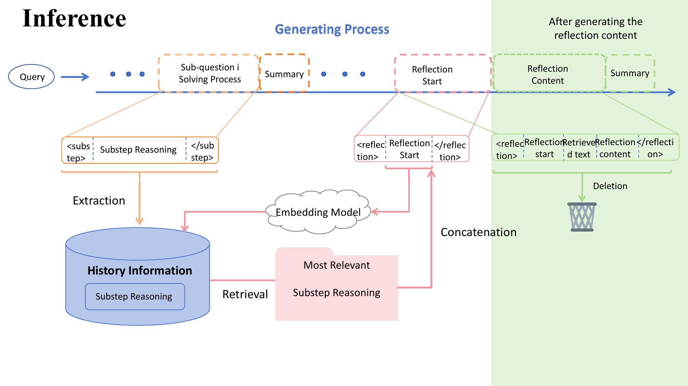
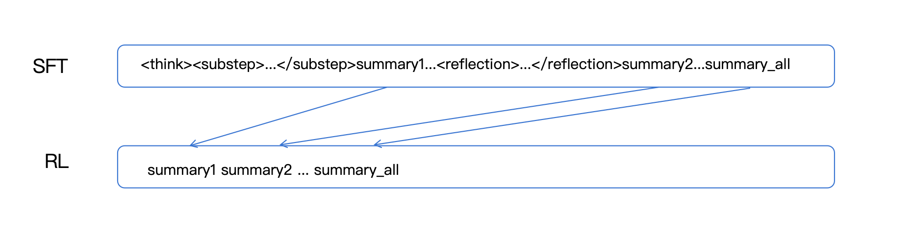

## 1. 项目背景与动机

### 核心问题

在测试时扩展（Test-Time Scaling）场景下，大模型需要进行深度、多步骤推理（如数学竞赛题 AIME）。然而，现有方法面临两大挑战：

* **上下文窗口限制**：长链推理会超出模型的最大上下文长度。
* **噪声累积**：历史推理步骤过多时，模型难以聚焦于关键信息（"Lost in the Middle" 现象）。

### 解决方案：Bookmark 框架

Bookmark 框架提出了一种**动态上下文压缩与检索**机制：

* **Substep Archiving**：将推理过程分解为多个子步骤，每个子步骤完成后生成摘要并"归档"。
* **Retrieval-Augmented Reflection**：当模型需要回顾历史时，通过检索机制从归档中提取相关信息，而非保留完整上下文。

这使得模型在推理过程中始终保持**精简的活跃上下文**，有效解决了上下文窗口和噪声累积问题。

---

## 2. 方法论详解

### 推理流程 (Inference Pipeline)

如下图所示，Bookmark 框架的推理流程包含以下核心组件：

* **Substep Tagging**：使用 `<substep>...</substep>` 标签将推理过程切分为离散步骤。
* **Bookmark Generation**：每个子步骤结束后，模型生成一个简洁的摘要（Bookmark），保存到 Archive。
* **Retrieval Trigger**：当模型遇到需要回顾历史的节点时（如 `<reflection>`），触发检索机制 from Archive 中提取相关 Bookmark。
* **Context Refresh**：用检索到的 Bookmark 替换原始长上下文，输入模型继续推理。

### 训练策略 (Training Pipeline)

如下图所示，训练分为两个阶段：

#### Stage 1: 监督微调 (SFT)

* **目标**：让模型学会生成结构化标签（`<substep>`, `<reflection>`）和 Bookmark 摘要。
* **数据来源**：使用 **s1.1** 和 **LIMO** 数据集，通过 Gemini-3.0-flash 对原始 CoT 进行结构化标注。
  * 利用大模型的逻辑判断能力对推理过程进行逻辑划分，使得推理过程分解成一个个包含子节点（子步骤和反思步骤）的信息。
  * 利用子节点信息和正则化匹配的方法 将原始推理过程 用 `<substep>...</substep>和<reflection>...</reflection>`分割
  * 有了标识符之后再利用大模型对每一对标识符进行总结，供后续RL动态推理使用。
* **模型**：Qwen3-8B Backbone。
* **损失函数**：标准自回归损失 $\mathcal{L}_{SFT} = -\sum_{t} \log P(x_t | x_{<t})$。

#### Stage 2: 强化学习 (GRPO)

* **算法**：Group Relative Policy Optimization (GRPO)，无需 Critic 网络，通过组内相对优势进行优化。
* **奖励函数设计**：

  $$
  R_{total} = w_{ans} \cdot \mathbb{I}(\text{Answer} == GT) + w_{fmt} \cdot Score_{format}
  $$

  * **准确性奖励 ($w_{ans}=1.0$)**：最终答案是否正确，占主导地位。
  * **格式奖励 ($w_{fmt}=0.5$)**：是否正确使用了 `<substep>` 等标签，权重较低
* **训练过程：在模型推理过程中**

  * 当生成遇到完整的 `<substep>...</substep>` 标识符对时，模型要将 `<substep>...</substep>`之间的内容抽取出来，存储在Archive中，
    形如 {`<substep1>...</substep1>`: $Emb\_{1}$, `<substep2>...</substep2>`: $Emb_{2}$...}
  * 当生成遇到 `<reflection>` 的首标识符时, 这时采取的动作是 计算 后两句话的Embedding向量，然后去Archive中检索最相关的子步骤$S_i$,将$S_i$插入这两句话的后面，然模型继续推理，只是此时的前文内容是 summary1,summary2 ... + $S_i$

### 最终效果

## 3. 实验设置

### 数据构建

* **来源**：s1.1 + LIMO 数据集（约 700 条高质量标注样本）。
* **流程**：原始 CoT → Gemini 分段 → 生成摘要 → 拼接标签。

### 训练配置

| 参数                                | 值                      |
| :---------------------------------- | :---------------------- |
| **设备**                      | 4 × NVIDIA A800 (80GB) |
| **框架**                      | `verl` (GRPO 实现)    |
| **Group Size**                | 8                       |
| **KL 系数**                   | 0.001                   |
| **$w_{ans}$ / $w_{fmt}$** | 1.0 / 0.1               |

---

## 4. 实验结果

### SFT 阶段性能 (Qwen3-8B)

| 指标                          | AIME 2025 | AIME 2024 |
| :---------------------------- | :-------: | :-------: |
| **Overall Pass@1**      |  41.67%  |  53.33%  |
| **完全正确 (100% Acc)** |   1/30   |   2/30   |
| **完全失败 (0% Acc)**   |   8/30   |   3/30   |
| **平均 Token 数**       |  15,702  |  13,911  |

**分析**：

* 对于一个 8B 模型，在 AIME 上取得 40%+ 的 Pass@1 是非常有意义的结果。
* 高 Token 数（约 14k-15k）表明模型确实在进行深度、长链推理。
* 预期后续 GRPO 阶段将进一步提升准确率，通过惩罚噪声累积、奖励高密度推理步骤。

---

## 5. 未来工作

* **RL 训练扩展**：在更多数据集上进行大规模 GRPO 训练，观察是否能涌现更高级的策略行为。
* **算法优化**：探索 **DAPO** 等更稳定的对齐算法，优化准确性与格式奖励的权衡。
* **跨模型验证**：在 Llama-3、32B 等更大模型上验证框架的通用性。

---
