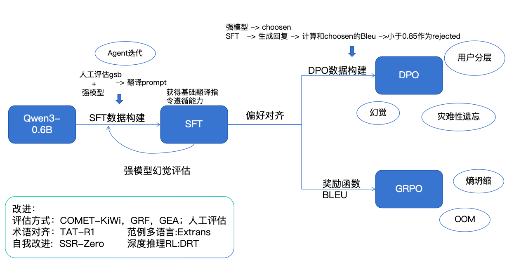

### 项目背景

**目标**：构建一个专注于将英文论文翻译为流畅中文的垂直领域小模型。

**痛点分析**：

* **现有工具问题**：传统的翻译工具（如 Google Translate）往往过于直译，缺乏学术语境的润色，读起来拗口。
* **大模型限制**：SOTA 大模型（如 GPT-4）效果好但 API 成本高，且并发受限，不适合大规模文档处理。

**项目方案**：

* **核心策略**：基于开源小模型（如 Qwen系列）进行指令微调（SFT）和偏好对齐（DPO）。
* **优势**：实现低成本、高并发的本地化部署，同时通过垂直数据训练保证专业术语准确和表达流畅。

### 整体流程

### 数据工程

#### 数据集构建策略

* **Teacher-Student 蒸馏**：利用 SOTA 模型生成高质量翻译作为“金标准”。
  * *Prompt 技巧*：要求模型“先直译，再意译，最后润色”，或者使用 "Chain of Thought" 让模型解释术语。
* **多模型采样**：使用 Qwen不同参数量的模型生成候选结果，通过人工或模型（LLM-as-a-Judge）筛选最佳答案。
* **坏例修正 (Self-Correction)**：针对 Bad Case 修改 Prompt 重新生成，加入微调数据集。
* **SFT数据集**:
  * **收集原文:** 近一年arxiv论文->随机筛选2w篇->每篇随机筛选一页->dot.ocr提取文本提出reference后的页数->每页按段落切分文档，选择字数小于512单词的数据
  * **构造翻译prompt** :尝试不同格式提示词（直接翻译，cot分析翻译，think模式翻译）以及不同的模型（qwen3-0.6B，qwen3-1.7B，qwen3-8B，qwen3-32B）；挑选AI领域段落（个人比较熟悉），人工gsb逐轮次迭代prompt要求（eg：见下面的翻译规范要求）
  * **构造样本:** 利用得到的最好的prompt和相对较大的模型（qwen3-32B）去生成sft数据

#### 翻译规范要求

* **信息无损**：严禁漏译核心观点。
* **格式保留**：Markdown 格式、LaTeX 公式、引用链接必须原样保留。
* **术语一致**：建立专有名词词表（Glossary），确保 "Attention" 翻译为 "注意力" 而不是 "关注"。

#### DPO 数据筛选与构建 (Pair 构造)

* **Chosen (参考翻译)**：利用得到的最好的prompt和相对较大的模型（qwen3-32B）去生成sft数据
* **Rejected (候选翻译)**：SFT后的模型进行翻译（约2w条）->过滤bleu<0.85的样本(约1.8w条)) -> DPO训练
  * 经过SFT后的输出大部分在0.5上下，我们这里过滤设置为0.85就是认为小于0.85的都算作rejected样本，目的是想让模型尽可能向参考翻译学习
  * 如果bleu设置小一些，例如0.5。模型本来生成的分数就在这个分数段，没有太大意义。我们想让模型区分什么是好样本，什么是坏样本。所谓的好样本，应该是和参考翻译很贴近。

## 评估

### 最终结果评估

| 评估指标 | 描述 | 备注 |
| :------- | :--- | :--- |
| **BLEU** | 基础语义对齐评估 | 核心是与人对齐。大模型无法解决"拗口"的问题，有时候大模型给一段话评分很高，但人读起来比较费解。 |
| **GSB (Good/Same/Bad)** | 人工或模型对比评估 | 人工评价翻译质量的相对优劣 |

### 过程评估

| 评估维度 | 方法 | 说明 |
| :------- | :--- | :--- |
| **幻觉率评估** | 大模型评估 | 大部分翻译问题可由 Prompt 解决，幻觉问题更多要从训练数据层面入手 |

## SFT

### 灾难性遗忘:数据量较小或偏离原模型分布，模型可能会强行拟合新任务，从而覆盖掉原来的语言能力或推理能力

* 混合数据训练
* 降低学习率，采取Warmup等操作
* Lora微调
* 损失函数，KL散度

本质上就是减少参数更新幅度，减少更新范围，减少分布偏移。

**参数选择：**

**不同规模模型的推荐学习率参考 (LoRA/QLoRA)**

以下表格整理了在不同模型规模下，**SFT**（指令微调）与 **DPO**（偏好优化）的推荐学习率区间。

| 模型规模 (Model Scale) | SFT 推荐 LR (LoRA)     | DPO 推荐 LR            | 备注 (Notes)                                                                          |
| :--------------------- | :--------------------- | :--------------------- | :------------------------------------------------------------------------------------ |
| **0.5B - 1.8B**  | **2e-4 — 5e-4** | **5e-6 — 1e-5** | 模型较小，相对“坚韧”，可以使用较大的步长快速收敛。                                  |
| **7B - 8B**      | **5e-5 — 1e-4** | **1e-6 — 3e-6** | 主流模型规模（如 Llama 3, Qwen 2.5）。**5e-7** 通常是下限，过低会导致收敛极慢。 |
| **14B - 32B**    | **1e-5 — 5e-5** | **5e-7 — 1e-6** | 参数量较大，即使是 LoRA 也需要非常小心，LR 过大容易导致灾难性遗忘。                   |
| **70B+**         | **5e-6 — 1e-5** | **1e-7 — 5e-7** | 极小的步长，通常配合极大的 Batch Size 进行训练。                                      |

> **关键指标参考**：
>
> * **GRPO**: 学习率通常建议 **≤ 1e-5** (Full) 或 **5e-5** (LoRA)，Beta 推荐 **0.001**。
> * **DPO 监控**: 重点关注 `rewards/chosen`、`rewards/rejected` 和 `rewards/margins`。

## DPO

### 训练过程中重点关注的指标

| 指标                      | 含义与关注点                                   | 异常情况                                          |
| :------------------------ | :--------------------------------------------- | :------------------------------------------------ |
| **Training Loss**   | 模型拟合数据的程度。                           | 若不下降，可能是学习率太小或数据质量差。          |
| **Validation Loss** | 泛化能力。                                     | 若 Train 下降但 Val 上升，说明**过拟合**。  |
| **Accuracy**        | Chosen 的 Reward > Rejected 的 Reward 的比例。 | 理想应稳步上升至 0.6~0.8。若接近 1.0 可能过拟合。 |
| **Reward Margin**   | $R_{chosen} - R_{rejected}$ 的差值。         | 应逐渐变大。若 Margin 极小，说明模型分不清好坏。  |

### DPO数据构造出现样本不均衡的问题怎么办？

样本不均衡通常指不同类型的 prompt 数量差异大，或者 chosen/rejected 长度、质量分布不一致。

* **分层采样 (Stratified Sampling)**：按任务类型（如翻译、代码、逻辑）对数据进行分类，训练时保证每个 batch 内各类别比例均衡。
* **加权 Loss (Weighted Loss)**：对稀缺样本类别赋予更高的 Loss 权重，强迫模型关注少样本任务。
* **数据增强 (Data Augmentation)**：利用 LLM 改写少样本类别的 prompt，或者通过 Self-Instruct 合成更多同类数据。
* **调整 Rejected 采样策略**：如果某些 chosen 回复很难找到好的 rejected（或者 rejected 太强），尝试生成更多样化的负样本（如不同温度采样），确保 margin 有区分度。

### 论文翻译任务中遇到的幻觉以及是如何解决的？

在论文翻译这种对“精确度”要求极高的场景下，幻觉往往表现为术语乱译、公式篡改或逻辑扭曲。以下是几个典型案例及其解决方案：

#### 1：术语一致性幻觉 (Terminology Inconsistency)

* **具体问题**：模型将同一术语在上下文中翻译得不一致，或者出现低级错误（如将 "Transformer" 翻译成 "变压器"）。
* **解决过程**：
  * **问题定位**：发现模型在没有外部约束时，倾向于根据局部语境选择最常见的词汇，而非专业学术词汇。
    * **解决方案**：
      * **Glossary Injection (提示工程)**：在 Prompt 中动态注入领域术语表（如：`{ "Attention Mechanism": "注意力机制" }`），强制约束。
      * **SFT 阶段约束**：在训练数据中加入大量带术语保护的样本，让模型学会尊重特定实体。

#### 2：公式的“降维打击” (Equation/LaTeX Hallucination)

* **具体问题**：在处理 LaTeX 公式时，模型会自作聪明地修改下标、变量名，甚至因为 Markdown 渲染问题丢失反斜杠。
* **解决过程**：
  * **问题定位**：Tokenizer 对 LaTeX 特殊字符（如 `\`、`_`、`^`）的切分导致模型对公式结构的语义理解出现偏差。
  * **解决方案**：
    * **正则占位符保护**：翻译前用正则匹配公式并替换为占位符（如 `<MATH_0>`），翻译完成后再进行原位回填。
    * **代码感知微调**：在微调数据中刻意保留复杂的 LaTeX 结构，确保模型将其识别为“不可触碰”的特殊 Toekn。

#### 3：引用标签丢失 (Citation/Link Hallucination)

* **具体问题**：原文中的引用（如 `[24, 31]`）在译文中消失，导致学术严谨性受损。
* **解决过程**：
  * **问题定位**：模型认为引用标签是“噪声”，在生成流畅译文时将其忽略。
  * **解决方案**：
    * **Rule-based Reward (RL 阶段)**：在使用 GRPO/PPO 训练时，设计一个"引用一致性奖励函数"。如果译文中的引用标签数量与原文不符，扣除大量 Reward。
    * **数据清洗**：剔除 SFT 数据集中任何丢失引用标签的 Bad Case。

---

### DPO缓解幻觉时，反而引入了新的幻觉，可能是什么原因？

在尝试通过 DPO 修复上述幻觉时，有时会发现模型出现了“越对齐越离谱”的情况，主要原因为：

* **偏好数据中的“事实性错误”被误选**：
  * **现象**：构建数据时，如果 Chosen 回复虽然流畅但包含由模型编造的错误事实（幻觉），而 Rejected 仅仅是因为语气不好主要事实是对的。
  * **举例**：Chosen 是“Transformer 是由 Google 在 2018 年提出的（此处年份错误，应为 2017）”，而 Rejected 是“Transformer 是 Google 2017 年提出的项目。”，但因为前者句式更漂亮被标为 Chosen。
  * **后果**：DPO 会强化模型去学习那个“流畅但错误”的陈述，导致新幻觉。
  * **解决办法**：引入“事实对齐”环节。在数据筛选阶段增加事实性校验（Fact-checking），若 Chosen 存在事实错误，则该 Pair 必须舍弃或修正，不能仅凭语气打分。
* **过度优化（Over-optimization / Reward Hacking）**：
  * **现象**：模型发现“胡说八道”但在格式、长度或语气上极度讨好（Sycophancy）能获得更低的 Loss。
  * **举例**：偏好数据中 Chosen 往往比 Rejected 长，模型学到了“长=好”的捷径，于是生成了大量毫无意义的修饰词和废话，甚至为了凑字数开始编造细节。
  * **后果**：特别是 Beta 过小时，模型挣脱了 SFT 的约束，开始放飞自我。
  * **解决办法**：适当增大 Beta 参数（如从 0.05 调回 0.1），加强对参考模型的约束；同时在数据构造时平衡 Chosen 和 Rejected 的长度分布。
* **Chosen 和 Rejected 的分布差异过大（OOD）**：
  * **现象**：例如 Chosen 是 GPT-4o生成的完美答案，而训练模型很弱。
  * **举例**：1.8B 的小模型被迫模仿 GPT-4o 的高深逻辑 and 复杂句式，就像小学生模仿博士写论文，虽然语气很像（使用了大量“综上所述”、“显而易见”），但中间的推导逻辑全是错的。
  * **后果**：模型在 SFT 阶段没见过这么高质量的数据，DPO 强行拉近模型与 32B 的分布，导致模型“不懂装懂”，产生逻辑幻觉。
  * **解决办法**：先进行高质量的 SFT 让模型“见过世面”，或者采用“由弱到强”的对齐策略，先用与模型能力更接近的优质数据做 DPO 演进。
* **负样本质量太差**：
  * **现象**：如果 Rejected 样本太过于离谱（如乱码、完全不相关），模型很容易区分。
  * **举例**：Rejected 样本全是 `asdfghjkl` 或“我不明白你在说什么”。模型只需要学会“不发疯”就能赢过 Rejected，而无法学到“将词语 A 翻译成词语 B 更好”这种细粒度的真实性差异。
  * **后果**：这种情况下 DPO 训练变得太简单，模型学不到细粒度的“真实性”差异，反而因为梯度更新导致参数漂移。
  * **解决办法**：构造“困难负样本 (Hard Negatives)”。通过对同一 Prompt 进行多次采样，选择那些逻辑通顺但包含细微错误、或术语使用不当的样本作为 Rejected。

### DPO 中的 Beta 参数详解

**Beta ($\beta$)** 是 KL 散度（KL Divergence）的系数，用于控制**新策略（Policy）与参考策略（Reference Model）之间的偏离程度**。

* **Beta 过大 (e.g., > 0.5)**：
  * **影响**：对模型的约束极强，模型不敢轻易改变，输出会非常接近 SFT 模型。
  * **结果**：训练非常稳定，但 Optimization 效果差，模型学不到这一步偏好。
* **Beta 过小 (e.g., < 0.05)**：
  * **影响**：约束太弱，模型为了最大化 Reward 可能会“放飞自我”。
  * **结果**：容易出现 **Reward Hacking**（例如：生成一堆乱码但长度符合要求，或者开始复读），导致语言能力崩坏，输出可读性下降。

**推荐值**：通常在 **0.1** 左右。

## GRPO

### GRPO vs PPO

* **核心区别**：
  * **Critic 模型**：PPO 需要训练一个额外的 Value Network (Critic) 来评估状态价值；**GRPO 不需要 Critic**，它通过同一 Prompt 生成的一组（Group）输出计算 Baseline（例如组内平均分）。
  * **计算效率**：GRPO 省去了 Critic 模型的显存占用 and 计算量，更适合大模型训练。
* **为什么 GRPO 更高效**：
  * **Group Baseline**：对于推理/数学问题，答案通常只有一个对错。GRPO 通过从群体中对比，能更直接地利用“相对优劣”作为信号，减少方差。
  * 适合 **Training-free** 场景的进一步优化（如 DeepSeek-R1 的思路）。

### GRPO奖励函数 (Reward Function) 设计

#### BLEU：得分越高奖励越大

后续可以考虑加入幻觉惩罚，用大模型评估

## 训练经验

### 核心参数与模型规模对照表

| 参数维度              | 策略类型        | 小规模模型 (0.5B - 3B) | 中等规模模型 (7B - 14B) | 大规模模型 (32B - 70B+) |
| :-------------------- | :-------------- | :--------------------- | :---------------------- | :---------------------- |
| **学习率 (LR)** | DPO             | 5e−6 ～ 1e−5         | 1e−6 ～ 3e−6          | 1e−7 ～ 1e−6          |
|                       | GRPO            | 1e−5 ～ 2e−5         | 5e−6 ～ 1e−5          | 1e−6 ～ 5e−6          |
| **核心系数**    | DPO ($\beta$) | 0.05 ～ 0.1 (较激进)   | 0.1 (标准)              | 0.1 ～ 0.3 (较保守)     |
|                       | GRPO (KL)       | 0.001 ～ 0.005         | 0.001                   | 0.001 ～ 0.01           |
| **Batch Size**  | 共同趋势        | 较小即可收敛           | 中等                    | 必须配合大 Global Batch |

### Beta / KL 系数的影响指南

| 维度               | $\beta$ / KL 系数 较小 (例如 DPO 0.01)                         | $\beta$ / KL 系数 较大 (例如 DPO 0.5)                     |
| :----------------- | :--------------------------------------------------------------- | :---------------------------------------------------------- |
| **对齐强度** | **强力对齐**：模型会竭尽全力迎合偏好数据。                 | **保守对齐**：模型更新缓慢，更倾向于保留 SFT 的能力。 |
| **模型风险** | **高风险**：容易出现“奖励黑客”，输出可能变得怪异或复读。 | **低风险**：训练稳定，但可能感觉模型“没怎么变”。    |
| **适用场景** | 偏好数据质量极高、需要模型大幅改变行为。                         | 保护模型的基础对话能力、防止推理逻辑崩坏。                  |
| **逻辑表现** | 可能为了符合格式而牺牲逻辑。                                     | 逻辑更稳健，但对格式的依从性提升较慢。                      |

### 实战调参速查表：不同工况下的参数干预

当训练出现以下“症状”时，可参考以下“处方”进行参数调整：

| 遇到的情况 (Scenario)                                                             | 学习率 (LR) 调整                  | Beta / KL 调整          | 调控原理 (Reasoning)                                                                          |
| :-------------------------------------------------------------------------------- | :-------------------------------- | :---------------------- | :-------------------------------------------------------------------------------------------- |
| **模型收敛极慢 / Loss 下降不明显**                                          | **⬆️ 适当调大**           | ⬇️ 可微调小           | 模型更新动力不足，需要更大的步长；减小 Beta 可放松对参考模型的约束。                          |
| **训练不稳定 / Loss 剧烈震荡**                                              | **⬇️ 减小 (0.5x - 0.1x)** | **⬆️ 调大**     | 步长过大导致在最优解附近跳动；增大 Beta 可增强稳定性，防止模型参数剧烈变化。                  |
| **出现幻觉 / 语言能力严重退化** ` `*(灾难性遗忘)*                    | **⬇️ 减小**               | **⬆️ 显著调大** | 模型偏离了原始 SFT 分布。增大 Beta/KL 强迫模型保持在 SFT 模型附近，保护基础能力。             |
| **“奖励黑客” (Reward Hacking)**` `*(分数很高但回复逻辑差/Trick多)* | ➖ 保持或微降                     | **⬆️ 调大**     | 模型为了高分钻了空子。增大 Beta 相当于增加“正则化”惩罚，限制模型走捷径。                    |
| **模型“太顽固” / 对齐效果不明显**                                         | ⬆️ 尝试调大                     | **⬇️ 调小**     | 约束太强（Beta 过大）或更新太慢（LR 过小）。减小 Beta 允许模型探索与 SFT 差异更大的策略空间。 |
| **过拟合 (验证集 Loss 上升)**                                               | ⬇️ 减小                         | **⬆️ 调大**     | 模型开始死记硬背训练数据。增大 Beta 有助于泛化，防止对特定偏好样本过度优化。                  |

### BadCase 处理全流程

* **归因分析**：
  * 是 SFT 没学好（知识缺失）？ -> **补 SFT 数据**。
  * 是 DPO 跑偏了（幻觉/复读）？ -> **调整 Beta or 检查负样本质量**。
  * 是 Prompt 不懂指令？ -> **优化 System Prompt**。
* **数据闭环**：
  * 将 BadCase 收集起来，人工修正得到 Correct Answer。
  * 构造 `(Question, Bad_Answer)` 作为 Rejected，`(Question, Correct_Answer)` 作为 Chosen。
  * 加入微调集进行下一轮迭代。
